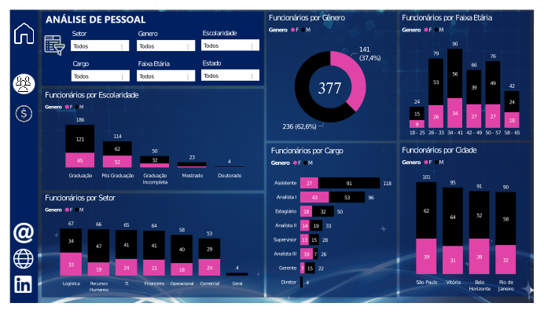
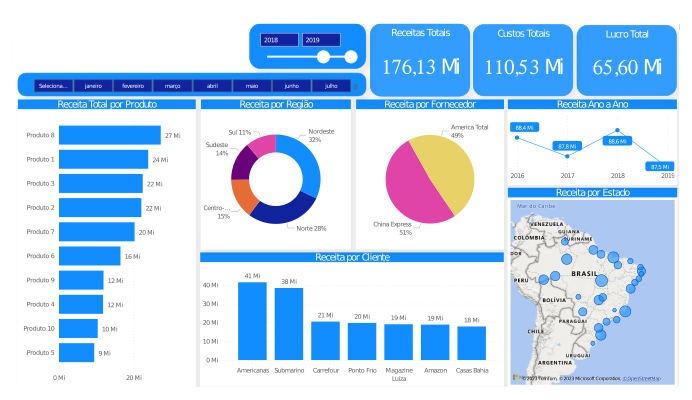

# Primeiros passos com Power BI
---

  
&nbsp;&nbsp;&nbsp;
O **Power BI** é uma plataforma de análise de dados e visualização voltada para o mundo dos negócios. Entre suas principais vantagens estão a interface descomplicada e intuitiva, que facilita a coleta, transformação e visualização de dados de várias fontes. Isso resulta em painéis interativos com gráficos, tabelas dinâmicas, mapas e muito mais, dos quais é possível extrair insights significativos dos dados.

&nbsp;&nbsp;&nbsp;
No entanto, também apresenta algumas desvantagens. Por exemplo, há o custo associado, pois embora exista uma versão gratuita, ela possui limitações em termos de recursos e capacidades. Além disso, existe a dependência da conectividade e limitações em modelos de dados complexos. No entanto, para superar essas limitações, existem outras ferramentas gratuitas com ampla variedade de funções estatísticas e técnicas de análise, bem como capacidades poderosas de criação de gráficos e visualizações, como R ou Python.

&nbsp;&nbsp;&nbsp;
Apesar das limitações, conhecer o Power BI é extremamente benéfico, principalmente no contexto empresarial. Ele permite realizar análises de dados de maneira amigável e visualmente atraente, em comparação com outras ferramentas, como o Excel.

&nbsp;&nbsp;&nbsp;
Nesse contexto, meu aprendizado em Power BI foi adquirido por meio do estudo autodidata de vários cursos disponíveis na plataforma [Hormart](https://www.hotmart.com). Através desses cursos, consegui desenvolver diversos painéis e dashboards como parte das tarefas individuais de cada curso. A seguir, apresento três desses painéis juntamente com uma breve explicação:

**Dashboard: Análises de Estoque**
---

&nbsp;&nbsp;&nbsp;
A análise de estoque é uma prática crucial para empresas que lidam com produtos físicos. Ela envolve o monitoramento, avaliação e interpretação dos níveis de estoque, a fim de tomar decisões informadas sobre compras, vendas, produção e gestão dos recursos disponíveis.

&nbsp;&nbsp;&nbsp;
A analises de estoque feito com Power-BI do banco de dados de uma empressa ficitica permite o acompanhamento regular dos produtos para evitar escassez ou excesso, avaliar como o consumo de produtos varia ao longo do tempo, identificar produtos que estão em excesso ou que correm o risco de se tornarem obsoletos, etc.

&nbsp;&nbsp;&nbsp;
O dashoboard apresentado a seguir traz algumas dessas analises e se mostra importante para otimizar operações, reduzir custos e melhorar a satisfação do cliente.

|          |
|:--------:|
||
|**Dashboard de Análise de Estoque de uma empresa fictícia para monitorar os recursos disponíveis na empresa.**|

**Dashboard: Analises de Recursos Humanos**

---

&nbsp;&nbsp;&nbsp;
A análise de recursos humanos é um processo essencial para que as organizações compreendam e otimizem o desempenho de sua força de trabalho. Esse processo envolve a coleta, avaliação e interpretação de dados relacionados aos funcionários, permitindo tomar decisões informadas acerca de recrutamento, retenção, desenvolvimento e gestão de pessoal.

&nbsp;&nbsp;&nbsp;
A análise de recursos humanos, realizada por meio do Power BI com base nos dados de uma empresa fictícia, possibilita a análise da composição da força de trabalho em termos de escolaridade, diversidade de gênero, etnia, idade e outros critérios. Além disso, permite avaliar a competitividade dos pacotes de remuneração e benefícios em relação ao mercado. Também auxilia na identificação das áreas em que o investimento em treinamento é mais necessário.

&nbsp;&nbsp;&nbsp;
O dashboard apresentado a seguir proporciona uma compreensão aprofundada dos diversos aspectos relacionados aos funcionários e é uma ferramenta útil para a empresa.

|          |
|:--------:|
||
||
|**Dashboard do análises de recursos de uma empressa ficticia para**|

**Dashboard: Analises de Vendas**

---

&nbsp;&nbsp;&nbsp;
A análise de vendas é um processo essencial para as empresas compreenderem seu desempenho nas vendas, identificarem tendências, oportunidades e desafios, além de tomarem decisões estratégicas importantes.

&nbsp;&nbsp;&nbsp;
A análise de vendas, realizada através do Power BI com base nos dados de uma empresa fictícia, possibilita a avaliação dos produtos de maior saída e que mais contribuem para a receita total. Além disso, permite avaliar as vendas ao longo do tempo para identificar padrões sazonais, tendências de crescimento ou declínio, entre outros aspectos relevantes.

&nbsp;&nbsp;&nbsp;
O dashboard apresentado a seguir proporciona insights valiosos que permitem às empresas tomarem decisões mais inteligentes no que diz respeito a estratégias de vendas, marketing, alocação de recursos e desenvolvimento de produtos. Além disso, essa ferramenta auxilia na identificação de áreas de melhoria e no aproveitamento de oportunidades para aumentar a receita e a lucratividade.

|          |
|:--------:|
||
|**Dashboard do análises das vendas de uma empressa ficticia**|

